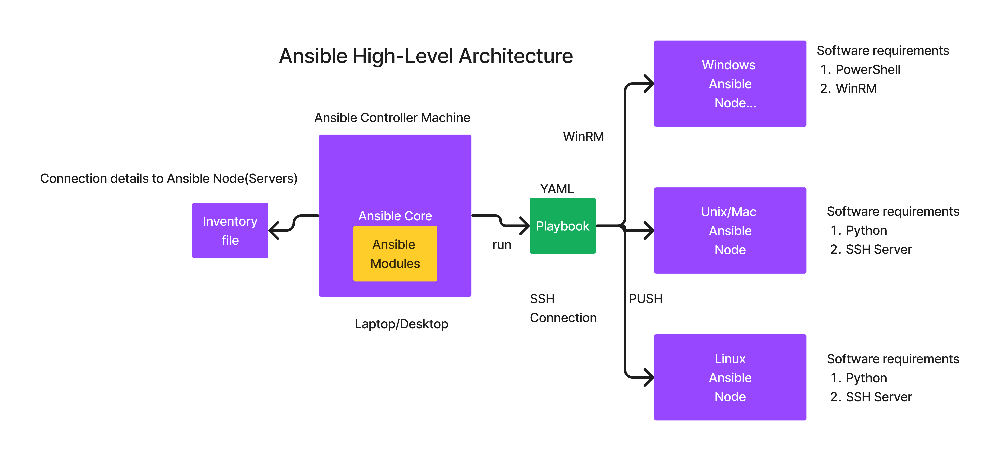
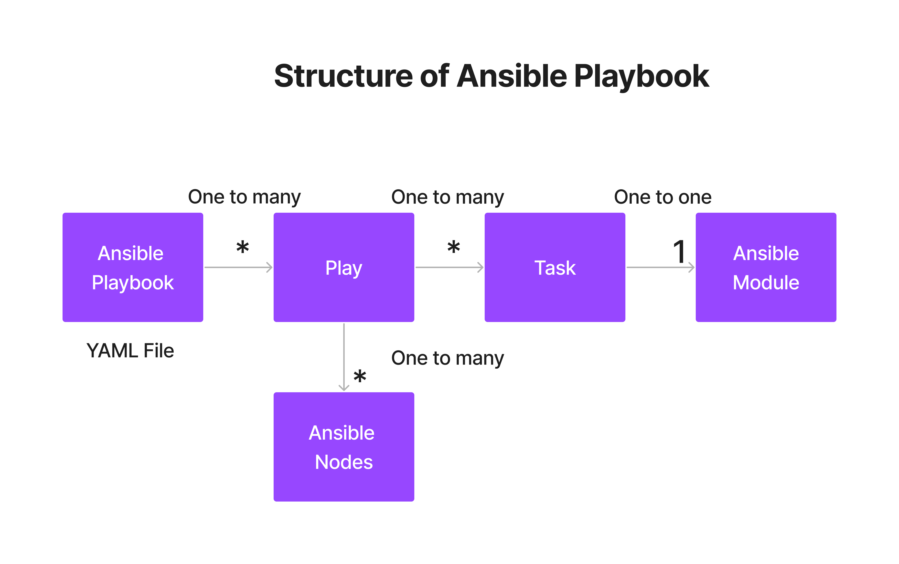

## What is Provisioning Tool?
- helps in creating a new Virtual Machine in the onPrem infrastructure, public/private/hybrid cloud
- automating OS installation
- Examples
  - Docker, Vagrant, Cloudformation, Terraform
- Terraform also supports some minimal Configuration Management Features

## What is Container Orchestration Platform?
- helps in managing your containerized application workloads
- helps in setting up High Available application within Container Orchestration Platform
- provides inbuilt monitoring tools
- supports scale up/down depending on the user traffice to your application workloads
- helps in exposing your application to external world using external Services
- helps in restriction your application access to only within the cluster using internal service
- self-healing platform
- Examples
  - Docker SWARM
  - Google Kubernetes
  - Red Hat OpenShift

## What is Configuration Management Tool?
- helps in automating software installation and configuration on a existing OS/Virtual machine in OnPrem servers, public/private/hybrid cloud environments
- also helps create users with specific access
- Ansible also supports some minimal provisioning features
 
## Provisioner vs Configuration Management Tool
- The strength of Provisioner tools is in creating a new Virtual Machine in OnPrem/Cloud environments
- Provisioner also supports some basic configuration management features, but it doesn't or can't replace the Configuration Management tools
- Generally provisioning tools like Terraform creates the Virtual Machine and then invoke Ansible to further configure the machine

## Ansible Overview
- is a Configuration Management tool
- develped by Michael Deehan in Python language
- helps in automating software installations/configuration typically automating any administrivative activities on a existing OS/Virtual machine
- comes in 3 flavours
  1. Ansible Core - opensource, supports command-line interface only, can be installed only in Linux/Mac
  2. AWX - opensource, supports Web Interface, playbook can be executed but not create, developed on top of Ansible Core
  3. Red Hat Ansible Tower - developed on top of AWX, hence supports Web Interface
- Domain Specific Language(DSL)
  - the langauge in which the automation code is written
  - DSL used by Ansible is YAML (Yet Another Markup Language)
## Ansible High Level Architecture


## Ansible Alternate Tools
- Puppet
- Chef
- Salt/SaltStack

## Installing Ansible
<pre>
https://docs.ansible.com/ansible/latest/installation_guide/installation_distros.html
</pre>

# Ansible Commands

## Lab - Cloning TekTutor Training Repository
```
cd ~
git clone https://github.com/tektutor/ansible-sep-2023.git
cd ansible-sep-2023
```

## Lab - Finding Ansible version
```
ansible --version
```

Expected output
<pre>
┌──(jegan㉿tektutor.org)-[~/ansible-sep-2023/Day2]
└─$ ansible --version
ansible [core 2.14.9]
  config file = None
  configured module search path = ['/home/jegan/.ansible/plugins/modules', '/usr/share/ansible/plugins/modules']
  ansible python module location = /usr/lib/python3/dist-packages/ansible
  ansible collection location = /home/jegan/.ansible/collections:/usr/share/ansible/collections
  executable location = /usr/bin/ansible
  python version = 3.11.2 (main, Mar 13 2023, 12:18:29) [GCC 12.2.0] (/usr/bin/python3)
  jinja version = 3.1.2
  libyaml = True
</pre>

## Lab - Building Custom Docker Image

We need to create key pair as shown below with default options
```
ssh-keygen
```

Expected output


## Lab - Building custom ubuntu ansible docker image
```
cd ~/ansible-sep-2023
git pull
cd Day2/CustomDockerImages/ubuntu
cp ~/.ssh/id_rsa.pub authorized_keys

docker build -t tektutor/ansible-ubuntu-node:latest .
```

Expected output


## Lab - Creating ubuntu1 and ubuntu2 container using our Custom Ubuntu Ansible node image
```
docker run -d --name ubuntu1 --hostname ubuntu1 -p 2001:22 -p 8001:80 tektutor/ansible-ubuntu-node:latest
docker run -d --name ubuntu2 --hostname ubuntu1 -p 2002:22 -p 8002:80 tektutor/ansible-ubuntu-node:latest 
docker images
```

Expected output


# Lab - Testing if we are able to ssh into ubuntu1 and ubuntu2 container
```
ssh -p 2001 root@localhost
exit
ssh -p 2002 root@localhost
exit
```

Expected output


## Lab - Running ansible ad-hoc command to ping the ansible nodes
```
cd ~/ansible-sep-2023
git pull
cd Day2/static-inventory
ansible -i inventory all -m ping
```

Expected output


## Lab - Ansible ping with verbosity enabled upto 4 levels for troubleshooting/debugging purpose
```
cd ~/ansible-sep-2023
git pull
cd Day2/static-inventory
ansible -i inventory all -m ping -vvvv
```

Expected output


## Lab - Using Ansible configuration file to point out the inventory ansible must be using
```
cd ~/ansible-sep-2023
git pull
cd Day2/static-inventory
cat ansible.cfg
ansible all -m ping
```

Expected output


## Lab - Using ansible setup module to collect facts about ubuntu1 ansible node
```
cd ~/ansible-sep-2023
git pull
cd Day2/static-inventory
ansible all -m setup
```

Expected output


## Lab - Getting help about ansible modules
```
ansible-doc -l
```

Expected output


## Lab - Finding total number of ansible modules supported by your version of Ansible
```
ansible-doc -l | wc -l
```

Expected output


## Lab - Getting help info about any ansible module
```
ansible-doc ping
ansible-doc shell
ansible-doc copy
ansible-doc file
ansible-doc template
ansible-doc service
ansible_doc docker_image
ansible_doc docker_container
ansible_doc setup
```

Expected output


## Ansible Playbook Structure



## Lab - Running your first ansible playbook
```
cd ~/ansible-sep-2023
git pull
cd Day2/playbooks
ansible-playbook -i ../static-inventory/inventory ping-ansiblenode-playbook.yml
```

Expected output


